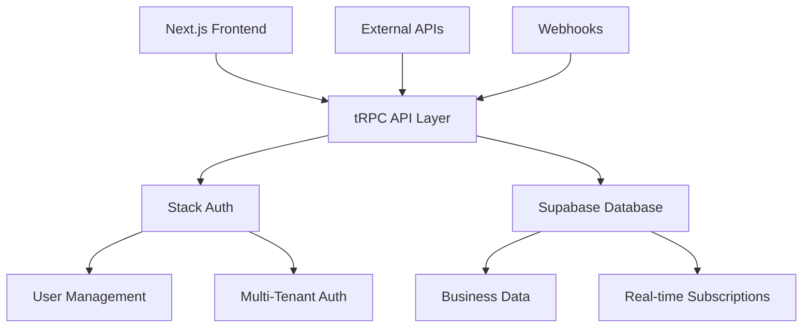

# XalesIn ERP - Modern Multi-Tenant ERP Solution


A modern, scalable, and secure multi-tenant ERP solution built with cutting-edge technologies. XalesIn ERP provides comprehensive business management capabilities with enterprise-grade security and performance.

## 🚀 Features

### Core Business Modules
- **📊 Financial Management** - Complete accounting, invoicing, and financial reporting
- **📦 Inventory Management** - Real-time stock tracking, warehouse management
- **👥 Customer Relationship Management** - Lead tracking, customer management
- **🏭 Supply Chain Management** - Vendor management, procurement, logistics
- **📈 Business Intelligence** - Advanced analytics and reporting
- **👤 Human Resources** - Employee management, payroll, attendance

### Technical Features
- **🔐 Multi-Tenant Architecture** - Secure tenant isolation with Stack Auth
- **⚡ Real-time Updates** - Live data synchronization with Supabase
- **🎯 Type-Safe APIs** - End-to-end type safety with tRPC
- **📱 Responsive Design** - Mobile-first UI with Tailwind CSS
- **🔒 Enterprise Security** - Role-based access control, audit logging
- **🌐 Internationalization** - Multi-language and multi-currency support
- **📊 Advanced Analytics** - Real-time dashboards and reporting
- **🔄 API Integration** - RESTful APIs and webhook support

## 🏗️ Architecture



### Technology Stack

#### Frontend
- **Next.js 15** - React framework with App Router
- **TypeScript** - Type-safe development
- **Tailwind CSS** - Utility-first CSS framework
- **Shadcn/ui** - Modern UI components
- **Framer Motion** - Smooth animations
- **React Hook Form** - Form management
- **Recharts** - Data visualization

#### Backend
- **tRPC** - Type-safe API development
- **Supabase** - PostgreSQL database with real-time features
- **Stack Auth** - Authentication and authorization
- **Zod** - Schema validation
- **React Query** - Data fetching and caching

#### DevOps & Tools
- **ESLint & Prettier** - Code quality and formatting
- **Jest** - Unit testing
- **GitHub Actions** - CI/CD pipeline
- **Vercel** - Deployment platform

## 🚀 Quick Start

### Prerequisites

- Node.js 18.0.0 or higher
- npm 8.0.0 or higher
- Git
- Supabase account
- Stack Auth account

### Installation

1. **Clone the repository**
   ```bash
   git clone https://github.com/xalesin/erp-xalesin.git
   cd multi-tenant-starter-template
   ```

2. **Install dependencies**
   ```bash
   npm install
   ```

3. **Environment Setup**
   
   Copy and configure your environment variables in `.env.local`:
   
   ```env
   # Stack Auth Configuration
   NEXT_PUBLIC_STACK_PUBLISHABLE_CLIENT_KEY=your_stack_publishable_key
   STACK_SECRET_SERVER_KEY=your_stack_secret_key
   STACK_PROJECT_ID=your_stack_project_id
   STACK_JWKS_URL=your_stack_jwks_url
   
   # Supabase Configuration
   NEXT_PUBLIC_SUPABASE_URL=your_supabase_url
   NEXT_PUBLIC_SUPABASE_ANON_KEY=your_supabase_anon_key
   SUPABASE_SERVICE_ROLE_KEY=your_supabase_service_role_key
   SUPABASE_PROJECT_ID=your_supabase_project_id
   
   # Application Configuration
   NEXT_PUBLIC_APP_URL=http://localhost:3000
   NODE_ENV=development
   ```

4. **Setup Stack Auth**
   - Register an account on [Stack Auth](https://stack-auth.com)
   - Copy the keys from the dashboard
   - Enable "client team creation" on the team settings tab
   - Paste the keys into your `.env.local` file

5. **Setup Supabase**
   - Create a new project on [Supabase](https://supabase.com)
   - Copy your project URL and anon key
   - Add them to your `.env.local` file

6. **Database Setup**
   ```bash
   # Generate Supabase types
   npm run db:generate
   
   # Run database migrations (if available)
   npm run db:migrate
   ```

7. **Start Development Server**
   ```bash
   npm run dev
   ```

   Open [http://localhost:3000](http://localhost:3000) in your browser.

## 📁 Project Structure

```
xalesin-erp/
├── components/          # Reusable UI components
│   ├── ui/             # Base UI components (Shadcn)
│   ├── forms/          # Form components
│   ├── charts/         # Chart components
│   └── layout/         # Layout components
├── lib/                # Utility libraries
│   ├── api.ts          # tRPC client configuration
│   ├── supabase.ts     # Supabase client setup
│   ├── stack-auth.ts   # Stack Auth integration
│   └── trpc.ts         # tRPC server configuration
├── pages/              # Next.js pages
│   ├── api/            # API routes
│   ├── auth/           # Authentication pages
│   ├── dashboard/      # Dashboard pages
│   └── _app.tsx        # App component
├── server/             # Server-side code
│   └── api/            # tRPC routers
│       ├── routers/    # Feature-specific routers
│       └── root.ts     # Main router
├── styles/             # Global styles
├── types/              # TypeScript type definitions
├── utils/              # Utility functions
├── middleware.ts       # Next.js middleware
├── env.mjs            # Environment validation
└── package.json       # Dependencies and scripts
```

## 🔧 Development

### Available Scripts

```bash
# Development
npm run dev              # Start development server
npm run build            # Build for production
npm run start            # Start production server

# Code Quality
npm run lint             # Run ESLint
npm run lint:fix         # Fix ESLint issues
npm run format           # Format code with Prettier
npm run type-check       # TypeScript type checking

# Testing
npm run test             # Run tests
npm run test:watch       # Run tests in watch mode
npm run test:coverage    # Run tests with coverage

# Database
npm run db:generate      # Generate Supabase types
npm run db:reset         # Reset database
npm run db:migrate       # Run migrations

# Utilities
npm run analyze          # Analyze bundle size
npm run clean            # Clean build artifacts
```

## 🔐 Authentication & Authorization

### Stack Auth Integration

XalesIn ERP uses Stack Auth for comprehensive authentication and authorization:

- **Multi-tenant Authentication** - Secure tenant isolation
- **Role-based Access Control** - Granular permissions
- **Social Login** - Google, Microsoft, GitHub integration
- **Session Management** - Secure session handling
- **Password Policies** - Configurable security policies

### Permission System

```typescript
// Example permission check
const hasPermission = await checkUserPermission(user, 'inventory.create')

// Available permissions
const PERMISSIONS = {
  // Inventory
  'inventory.view': 'View inventory items',
  'inventory.create': 'Create inventory items',
  'inventory.update': 'Update inventory items',
  'inventory.delete': 'Delete inventory items',
  
  // Financial
  'financial.view': 'View financial data',
  'financial.create': 'Create financial records',
  'financial.reports': 'Access financial reports',
  
  // Admin
  'admin.users': 'Manage users',
  'admin.settings': 'Manage system settings',
}
```

## 📊 Database Integration

### Supabase Features

- **PostgreSQL Database** - Robust relational database
- **Real-time Subscriptions** - Live data updates
- **Row Level Security** - Tenant data isolation
- **Auto-generated APIs** - RESTful and GraphQL APIs
- **Edge Functions** - Serverless compute
- **Storage** - File and media management

### Type Safety

```typescript
// Auto-generated types from Supabase
import { Database } from '@/types/supabase'

type Tables = Database['public']['Tables']
type Product = Tables['products']['Row']
type ProductInsert = Tables['products']['Insert']
type ProductUpdate = Tables['products']['Update']
```

## 🚀 Deployment

### Vercel Deployment (Recommended)

1. **Connect Repository**
   - Import project to Vercel
   - Connect GitHub repository

2. **Environment Variables**
   - Add all environment variables from `.env.local`
   - Ensure production URLs are used

3. **Deploy**
   ```bash
   npm run build
   vercel --prod
   ```

### Manual Deployment

```bash
# Build the application
npm run build

# Start production server
npm run start
```

## 🧪 Testing

### Test Structure

```
__tests__/
├── components/         # Component tests
├── lib/               # Utility tests
├── pages/             # Page tests
└── server/            # API tests
```

### Running Tests

```bash
# Run all tests
npm run test

# Run tests in watch mode
npm run test:watch

# Run tests with coverage
npm run test:coverage
```

## 🔒 Security

### Security Features

- **Authentication** - Stack Auth integration
- **Authorization** - Role-based access control
- **Data Validation** - Zod schema validation
- **SQL Injection Protection** - Supabase RLS policies
- **XSS Protection** - Content Security Policy
- **CSRF Protection** - Built-in Next.js protection
- **Audit Logging** - Comprehensive audit trail

## 🤝 Contributing

### Development Setup

1. Fork the repository
2. Create feature branch
3. Make changes with tests
4. Submit pull request

### Code Standards

- **TypeScript** - Strict type checking
- **ESLint** - Code quality rules
- **Prettier** - Code formatting
- **Conventional Commits** - Commit message format
- **Test Coverage** - Minimum 80% coverage

## 📄 License

This project is licensed under the MIT License - see the [LICENSE](LICENSE) file for details.

## 🆘 Support

### Documentation

- [Stack Auth Documentation](https://docs.stack-auth.com)
- [Supabase Documentation](https://supabase.com/docs)
- [Next.js Documentation](https://nextjs.org/docs)
- [tRPC Documentation](https://trpc.io/docs)

### Community

- [GitHub Issues](https://github.com/xalesin/erp-xalesin/issues)
- [Discussions](https://github.com/xalesin/erp-xalesin/discussions)

### Commercial Support

For enterprise support and custom development:
- Email: support@xalesin.com
- Website: [xalesin.com](https://xalesin.com)

---

**Built with ❤️ by the XalesIn Team**

*Empowering businesses with modern ERP solutions*
