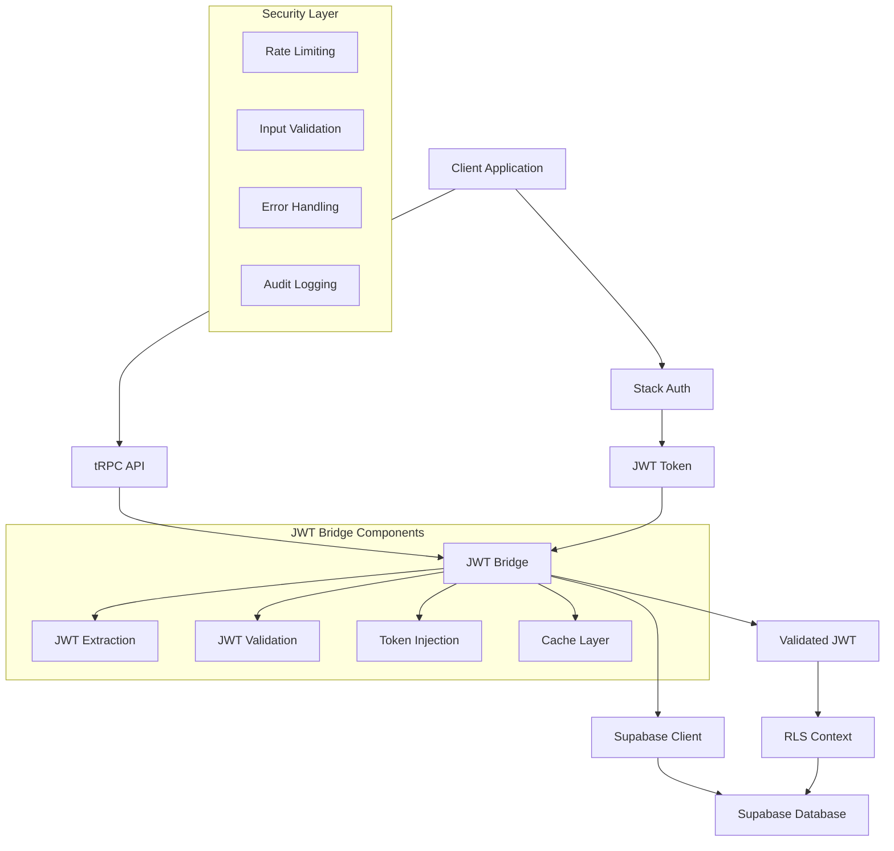

# JWT Token Bridge Implementation Guide

## 🎯 Overview

This document provides a comprehensive guide for the JWT Token Bridge implementation between Stack Auth and Supabase in the XalesIn ERP multi-tenant system. The bridge enables seamless authentication flow while maintaining security, performance, and scalability.

## 🏗️ Architecture Overview

### System Components



### Data Flow

1. **Authentication**: User authenticates with Stack Auth
2. **Token Extraction**: JWT token extracted from request headers/cookies
3. **Validation**: JWT signature and claims validated
4. **Transformation**: Stack Auth JWT transformed to Supabase-compatible format
5. **Injection**: JWT injected into Supabase client headers
6. **RLS Context**: Database context set based on JWT claims
7. **Authorization**: Row-level security policies enforce access control

## 📁 File Structure

```
├── lib/
│   ├── jwt-utils.ts              # JWT extraction, validation, and transformation
│   ├── supabase.ts               # Enhanced Supabase client with JWT injection
│   └── trpc.ts                   # tRPC middleware with JWT integration
├── components/
│   └── providers/
│       └── supabase-provider.tsx # Provider with JWT bridge integration
├── supabase/
│   └── migrations/
│       └── 20241220_jwt_bridge_rls_policies.sql # RLS policies for JWT claims
├── __tests__/
│   └── jwt-bridge.test.ts        # Comprehensive test suite
├── docs/
│   └── JWT-BRIDGE-IMPLEMENTATION.md # This documentation
└── jest.config.js                # Test configuration
```

## 🔧 Implementation Details

### 1. JWT Utilities (`lib/jwt-utils.ts`)

#### Key Features
- **Multi-source extraction**: Headers, cookies, and query parameters
- **Signature validation**: Cryptographic verification of JWT tokens
- **Claims transformation**: Stack Auth to Supabase format conversion
- **Caching layer**: In-memory cache with TTL for performance
- **Error handling**: Graceful degradation on validation failures

#### Core Functions

```typescript
// Extract JWT from various sources
export async function extractStackAuthJWT(req: Request): Promise<string | null>

// Validate JWT signature and claims
export async function validateStackAuthJWT(token: string): Promise<boolean>

// Transform to Supabase-compatible format
export async function createSupabaseCompatibleJWT(
  userContext: UserContext, 
  originalJWT: string
): Promise<string>

// Cache management
export function getJWTFromCache(key: string): string | null
export function clearJWTCache(): void
```

### 2. Enhanced Supabase Client (`lib/supabase.ts`)

#### Enhancements
- **Automatic JWT injection**: Seamless token integration
- **Fallback mechanisms**: Graceful handling of JWT failures
- **Performance monitoring**: Request timing and error tracking
- **Multi-tenancy support**: Tenant-aware client creation

#### Key Function

```typescript
export async function createAuthenticatedClient(
  userContext: UserContext,
  isAdmin: boolean = false,
  jwtToken?: string
): Promise<SupabaseClient<Database>>
```

### 3. tRPC Middleware Integration (`lib/trpc.ts`)

#### Features
- **Context enrichment**: JWT extraction in tRPC context
- **Automatic validation**: Built-in JWT verification
- **Error propagation**: Proper error handling and logging
- **Performance tracking**: Request timing metrics

### 4. RLS Policies (`supabase/migrations/20241220_jwt_bridge_rls_policies.sql`)

#### Database Functions

```sql
-- Extract user ID from JWT
CREATE OR REPLACE FUNCTION auth.jwt_user_id()
RETURNS text AS $$
  SELECT COALESCE(
    current_setting('request.jwt.claims', true)::json->>'sub',
    current_setting('request.jwt.claims', true)::json->>'user_id'
  );
$$ LANGUAGE sql STABLE;

-- Extract tenant ID from JWT
CREATE OR REPLACE FUNCTION auth.jwt_tenant_id()
RETURNS text AS $$
  SELECT current_setting('request.jwt.claims', true)::json->>'tenant_id';
$$ LANGUAGE sql STABLE;

-- Check user permissions
CREATE OR REPLACE FUNCTION auth.has_permission(permission_name text)
RETURNS boolean AS $$
  SELECT permission_name = ANY(
    ARRAY(
      SELECT jsonb_array_elements_text(
        current_setting('request.jwt.claims', true)::json->'permissions'
      )
    )
  );
$$ LANGUAGE sql STABLE;
```

#### Example RLS Policy

```sql
-- Tenant isolation for inventory items
CREATE POLICY "tenant_isolation_inventory" ON inventory_items
  FOR ALL USING (
    tenant_id = auth.jwt_tenant_id()
  );

-- Permission-based access
CREATE POLICY "inventory_read_permission" ON inventory_items
  FOR SELECT USING (
    auth.has_permission('inventory.read')
  );
```

## 🚀 Getting Started

### Prerequisites

- Node.js 18+
- TypeScript 5+
- Stack Auth account and project
- Supabase project
- Environment variables configured

### Environment Variables

```bash
# Stack Auth Configuration
STACK_AUTH_PROJECT_ID=your_stack_project_id
STACK_AUTH_SECRET_KEY=your_stack_secret_key
STACK_AUTH_PUBLISHABLE_CLIENT_KEY=your_stack_publishable_key

# Supabase Configuration
NEXT_PUBLIC_SUPABASE_URL=your_supabase_url
NEXT_PUBLIC_SUPABASE_ANON_KEY=your_supabase_anon_key
SUPABASE_SERVICE_ROLE_KEY=your_supabase_service_role_key

# JWT Configuration
JWT_SECRET=your_jwt_secret_key
JWT_ALGORITHM=HS256
JWT_EXPIRY=1h

# Cache Configuration
CACHE_TTL_SECONDS=300
CACHE_MAX_SIZE=1000
```

### Installation

1. **Install Dependencies**
   ```bash
   npm install @stackframe/stack @supabase/supabase-js jsonwebtoken
   npm install -D @types/jsonwebtoken jest ts-jest
   ```

2. **Run Database Migrations**
   ```bash
   npx supabase db push
   ```

3. **Run Tests**
   ```bash
   npm test
   ```

## 🧪 Testing Strategy

### Test Categories

1. **Unit Tests**
   - JWT extraction functions
   - Validation logic
   - Cache operations
   - Error handling

2. **Integration Tests**
   - End-to-end authentication flow
   - Database RLS policy validation
   - Multi-tenant isolation

3. **Performance Tests**
   - JWT processing speed
   - Cache hit rates
   - Database query performance

4. **Security Tests**
   - JWT signature validation
   - Token expiry handling
   - Rate limiting
   - Input sanitization

### Running Tests

```bash
# Run all tests
npm test

# Run with coverage
npm run test:coverage

# Run specific test suite
npm test jwt-bridge

# Run performance tests
npm run test:performance

# Run security tests
npm run test:security
```

## 📊 Performance Benchmarks

### Target Metrics

| Operation | Target Time | Acceptable Time |
|-----------|-------------|----------------|
| JWT Extraction | < 50ms | < 100ms |
| JWT Validation | < 30ms | < 50ms |
| Client Creation | < 100ms | < 200ms |
| Database Query | < 200ms | < 500ms |

### Optimization Strategies

1. **Caching**
   - JWT validation results cached for 5 minutes
   - User context cached per session
   - Database connection pooling

2. **Lazy Loading**
   - JWT validation only when needed
   - Database connections created on demand
   - Supabase client initialization deferred

3. **Parallel Processing**
   - Concurrent JWT validation and user lookup
   - Batch database operations
   - Async/await optimization

## 🔒 Security Considerations

### JWT Security

1. **Signature Validation**
   - Cryptographic verification of all JWTs
   - Support for multiple signing algorithms
   - Key rotation support

2. **Claims Validation**
   - Expiry time enforcement
   - Issuer verification
   - Audience validation
   - Custom claim validation

3. **Token Handling**
   - Secure token storage
   - No token logging
   - Automatic token refresh

### Database Security

1. **Row Level Security (RLS)**
   - Tenant isolation enforced at database level
   - Permission-based access control
   - Audit logging for all operations

2. **Input Validation**
   - SQL injection prevention
   - XSS protection
   - Input sanitization

3. **Rate Limiting**
   - Request rate limiting per user
   - JWT validation rate limiting
   - Database query throttling

## 🚨 Error Handling

### Error Categories

1. **Authentication Errors**
   - Invalid JWT signature
   - Expired tokens
   - Missing authentication

2. **Authorization Errors**
   - Insufficient permissions
   - Tenant access violations
   - Resource not found

3. **System Errors**
   - Database connection failures
   - Network timeouts
   - Service unavailability

### Error Response Format

```typescript
interface ErrorResponse {
  error: {
    code: string;
    message: string;
    details?: any;
    timestamp: string;
    requestId: string;
  };
}
```

### Fallback Mechanisms

1. **Graceful Degradation**
   - Fall back to standard authentication if JWT fails
   - Use cached data when services are unavailable
   - Provide limited functionality during outages

2. **Retry Logic**
   - Exponential backoff for transient failures
   - Circuit breaker pattern for service failures
   - Automatic retry for network errors

## 📈 Monitoring and Observability

### Key Metrics

1. **Performance Metrics**
   - JWT processing time
   - Database query duration
   - Cache hit/miss rates
   - Request throughput

2. **Error Metrics**
   - Authentication failure rate
   - JWT validation errors
   - Database connection errors
   - Rate limit violations

3. **Business Metrics**
   - Active user sessions
   - Tenant activity
   - Feature usage
   - Security incidents

### Logging Strategy

```typescript
// Structured logging format
interface LogEntry {
  timestamp: string;
  level: 'debug' | 'info' | 'warn' | 'error';
  message: string;
  context: {
    userId?: string;
    tenantId?: string;
    requestId: string;
    operation: string;
    duration?: number;
    error?: any;
  };
}
```

## 🔄 Deployment and Maintenance

### Deployment Checklist

- [ ] Environment variables configured
- [ ] Database migrations applied
- [ ] JWT secrets rotated
- [ ] Performance benchmarks met
- [ ] Security tests passed
- [ ] Monitoring configured
- [ ] Rollback plan prepared

### Maintenance Tasks

1. **Regular Tasks**
   - JWT secret rotation (quarterly)
   - Performance monitoring review (weekly)
   - Security audit (monthly)
   - Cache cleanup (daily)

2. **Monitoring**
   - Set up alerts for error rates
   - Monitor performance metrics
   - Track security incidents
   - Review audit logs

## 🆘 Troubleshooting

### Common Issues

1. **JWT Validation Failures**
   ```bash
   # Check JWT format
   echo "your_jwt_token" | base64 -d
   
   # Verify environment variables
   echo $JWT_SECRET
   ```

2. **Database Connection Issues**
   ```bash
   # Test Supabase connection
   curl -H "apikey: $SUPABASE_ANON_KEY" "$SUPABASE_URL/rest/v1/"
   ```

3. **Performance Issues**
   ```bash
   # Run performance tests
   npm run test:performance
   
   # Check cache hit rates
   npm run test:cache
   ```

### Debug Mode

```bash
# Enable debug logging
export LOG_LEVEL=debug
export DEBUG_JWT=true

# Run with debug output
npm run dev
```

## 📚 Additional Resources

- [Stack Auth Documentation](https://docs.stack-auth.com/)
- [Supabase RLS Guide](https://supabase.com/docs/guides/auth/row-level-security)
- [JWT Best Practices](https://tools.ietf.org/html/rfc7519)
- [Multi-tenant Architecture Patterns](https://docs.microsoft.com/en-us/azure/architecture/guide/multitenant/overview)

## 🤝 Contributing

When contributing to the JWT Bridge implementation:

1. Follow the existing code style and patterns
2. Add comprehensive tests for new features
3. Update documentation for any changes
4. Ensure security best practices are followed
5. Test performance impact of changes

## 📄 License

This implementation is part of the XalesIn ERP system and is proprietary software.

---

**Last Updated**: December 20, 2024  
**Version**: 1.0.0  
**Author**: XalesIn ERP Team